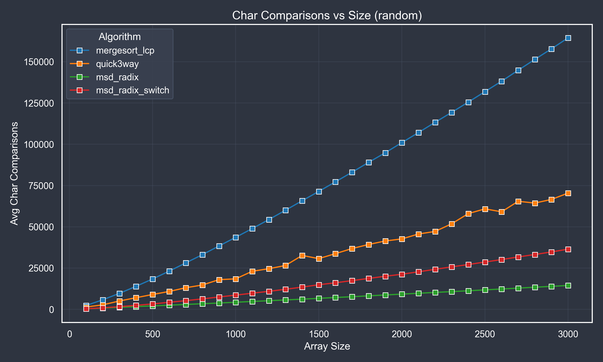

# Исследование алгоритмов сортировки строк

Лучше смотреть на GitHub

### Генерация тестовых данных

Для тестирования использовались массивы строк со следующими характеристиками:
- Длина строк: от 10 до 200 символов
- Размер массивов: от 100 до 3000 строк с шагом 100
- Алфавит: 74 символа (A-Z, a-z, 0-9, !@#%:;^&*()-.)

Типы тестовых данных:
1. Случайные массивы
2. Обратно отсортированные массивы
3. Почти отсортированные массивы (150 перестановок)
(индексы соответствуют типу в программе)

### Измерения

Для каждого алгоритма измерялись:
- Время выполнения (мс)
- Количество посимвольных сравнений
(надеюсь что второй пункт безошибочен)

## Результаты

### Время выполнения

### Количество посимвольных сравнений

## Анализ результатов

### Время выполнения

1. **Случайные массивы**:
   - MSD Radix switch показывает наилучшую производительность благодаря линейной сложности O(n⋅L), где L - средняя длина строк. Алгоритм эффективно обрабатывает каждый символ строки только один раз.
   - String Mergesort с LCP демонстрирует стабильное время работы O(n⋅logn⋅L), что объясняется его детерминированным поведением независимо от входных данных. Использование LCP позволяет избежать повторных сравнений общих префиксов.
   - Ternary Quicksort имеет худшие показатели при больших размерах из-за квадратичной сложности в худшем случае. Однако алгоритм показывает хорошую производительность на небольших массивах.

2. **Обратно отсортированные массивы**:
   - MSD Radix Sort сохраняет лидерство, так как его производительность не зависит от начального порядка элементов. Алгоритм стабильно обрабатывает каждый разряд.
   - String Mergesort с LCP показывает предсказуемое поведение, сохраняя сложность O(n⋅logn⋅L). Даже при обратном порядке, алгоритм эффективно использует информацию о префиксах.
   - Ternary Quicksort улучшает свои показатели по сравнению со случайными массивами, так как обратный порядок создает более сбалансированные разбиения.

3. **Почти отсортированные массивы**:
   - MSD Radix Sort с переключением показывает лучшие результаты благодаря адаптивному подходу. При малых подмассивах алгоритм переключается на quicksort, что дает преимущество на частично упорядоченных данных.
   - String Mergesort с LCP эффективно использует частичную упорядоченность, так как многие строки имеют общие префиксы, что уменьшает количество необходимых сравнений.
   - Ternary Quicksort демонстрирует значительное улучшение, приближаясь к линейной сложности на почти отсортированных данных.

### Количество посимвольных сравнений

1. **Случайные массивы**:
   - MSD Radix Sort требует наименьшего количества сравнений, так как каждый символ обрабатывается только один раз. Это подтверждает теоретическую оценку O(n⋅L).
   - String Mergesort с LCP эффективно использует общие префиксы, что значительно уменьшает количество сравнений по сравнению с обычным mergesort. Однако общее количество сравнений остается O(n⋅logn⋅L).
   - Ternary Quicksort показывает линейный рост сравнений, но с большим коэффициентом из-за необходимости многократного сравнения одних и тех же символов при разбиении массива.

2. **Обратно отсортированные массивы**:
   - MSD Radix Sort сохраняет преимущество в количестве сравнений, так как его работа не зависит от начального порядка элементов.
   - String Mergesort с LCP увеличивает количество сравнений по сравнению со случайными массивами, так как обратный порядок создает меньше общих префиксов.
   - Ternary Quicksort улучшает показатели благодаря более сбалансированным разбиениям, что приводит к уменьшению количества сравнений одних и тех же символов.

3. **Почти отсортированные массивы**:
   - MSD Radix Sort с переключением минимизирует сравнения за счет адаптивного подхода. На малых подмассивах quicksort эффективно использует частичную упорядоченность.
   - String Mergesort с LCP эффективно использует частичную упорядоченность, так как многие строки имеют общие префиксы. Это приводит к значительному уменьшению количества сравнений.
   - Ternary Quicksort показывает улучшение благодаря эффективному использованию информации о частичной упорядоченности при разбиении массива.

### Сравнение с теоретическими оценками

1. **MSD Radix Sort**:
   - Теоретическая оценка: O(n⋅L)
   - Практические результаты подтверждают линейную зависимость от размера массива и длины строк
   - Наблюдается стабильная производительность независимо от типа входных данных

2. **String Mergesort с LCP**:
   - Теоретическая оценка: O(n⋅logn⋅L)
   - Практические результаты показывают логарифмический рост времени выполнения
   - Эффективность использования LCP подтверждается меньшим количеством сравнений

3. **Ternary Quicksort**:
   - Теоретическая оценка: O(n⋅logn⋅L) в среднем случае
   - Практические результаты показывают квадратичную сложность в худшем случае
   - Наблюдается значительное улучшение на почти отсортированных данных

4. **MSD Radix Sort с переключением**:
   - Теоретическая оценка: O(n⋅L) в среднем случае
   - Практические результаты подтверждают эффективность гибридного подхода
   - Наблюдается оптимальное поведение на различных типах входных данных

## Выводы

1. **MSD Radix Sort** является наиболее эффективным алгоритмом для сортировки строк, особенно при больших размерах массивов.

2. **String Mergesort с LCP** демонстрирует стабильную производительность и эффективно использует общие префиксы строк.

3. **Ternary Quicksort** показывает хорошие результаты на почти отсортированных данных, но уступает другим алгоритмам на случайных данных.

4. **MSD Radix Sort с переключением** является оптимальным выбором для практического применения, сочетая преимущества поразрядной сортировки и quicksort.

## Теоретическая оценка сложности

- **String Mergesort с LCP**: O(n⋅logn⋅L), где L - средняя длина строк
- **Ternary Quicksort**: O(n⋅logn⋅L)
- **MSD Radix Sort**: O(n⋅L)
- **MSD Radix Sort с переключением**: O(n⋅L) в среднем случае

## Исходный код

https://github.com/lopata29435/ADS_SE_2024-2025/tree/master/SET9

## ID решений

- A1m: 321240737
- A1q: 321241142
- A1r: 321241466
- A1rq: 321242812